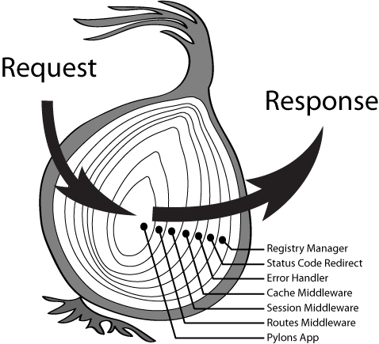

## fetch-crepe

> Native Fetch API client driven by middleware.

### Installation
```bash
npm install fetch-crepe --save
```

### Get Started
```javascript
import { makeRequest } from "fetch-crepe";

const response = await makeRequest({ url: "some/url/here "});
const responseData = response.data;
```

### Middleware
`fetch-crepe` is using the onion model from `koa` to implement middleware. The middleware functions are organized and executed in a stack like manner.
<br/>
<br/>
Here is the diagram of a typical onion model.
<br/>
<br/>

<br/>
<br/>
`fetch-crepe` contains a set of built-in middleware and supports customized middleware from caller.

| Middleware     | Description                                                       |
|----------------|-------------------------------------------------------------------|
| Set Defaults   | Apply default settings to fetch request                           |
| Abort          | Abort a request when it is timeout                                |
| Fetch Data     | Call native `fetch` API to send the request                       |
| Parse Response | Parse response data according to status code and response headers |


### Usage
#### Basic
```javascript
import { makeRequest } from "fetch-crepe";

const response = await makeRequest({ url: "some/url/here" });
const responseData = response.data;
```

#### Alias
```javascript
import request from "fetch-crepe";

// GET
request.get("some/get/url", { ...yourOptions });

// POST
request.post("some/post/url", {
  body: JSON.stringify({ dataKey: "dataValue" })
});

// PUT
request.put("some/put/url", {
  body: JSON.stringify({ dataKey: "dataValue" })
});

// PATCH
request.patch("some/patch/url", {
  body: JSON.stringify({ dataKey: "dataValue" })
});

// DELETE
request.delete("some/delete/url", {
  body: JSON.stringify({ dataKey: "dataValue" })
});
```

#### Custom Middleware
```javascript
import request from "fetch-crepe";

request.use(async (context, next) => {
  const requestConfig = context.req;
  // Manipulate the request config here
  // ...
  // Assign back to context
  context.req = requestConfig;
  
  await next();
  
  const response = context.res;
  // Manipulate the response here
  // ...
  // Assign back to context
  context.res = response;
});
```

#### Create Instance
If you need to use `fetch-crepe` with different settings in different cases in your application,
your can simply create multiple instances to achieve this.
```javascript
import { createInstance } from "fetch-crepe";

const requestInstanceV1 = createInstance({ baseURL: "/base/url/v1" });
const requestInstanceV2 = createInstance({ baseURL: "/base/url/v2" });
```

#### Mock
`fetch-crepe` supports various data types for mock data.
```javascript
import { makeRequest } from "fetch-crepe";

// Local json url
await makeRequest({
  url: "/some/url",
  useMock: true,
  mock: {
    url: "/mock/mockData.json"
  }
});

// Hardcoded value
await makeRequest({
  url: "/some/url",
  useMock: true,
  mock: {
    value: {
      success: true
    }
  }
});

// Callback
await makeRequest({
  url: "/some/url",
  useMock: true,
  mock: {
    value: async() => new Promise((resolve) => resolve({ success: true }))
  }
});

// Error
await makeRequest({
  url: "/some/url",
  useMock: true,
  mock: {
    value: new Error("error")
  }
});
```

#### Enable Mock via Middleware

Please notice that the following mock middleware only takes effects on the `fetch-crepe` instance. If you have defined multiple 
`fetch-crepe` instances in your application, you need to set up the middleware for all of them.

```javascript
import request from "fetch-crepe";

request.use(async (context, next) => {
  const requestConfig = context.req;
  requestConfig.useMock = true;
  requestConfig.mock = {
    ...requestConfig.mock,
    delay: 200
  };
  context.req = requestConfig;
  await next();
});
```

### API Reference
```javascript
import { makeRequest } from "fetch-crepe";

await makeRequest({
  url: "",                     // Contains the URL of the request.
  method: "GET",               // Contains the request's method (GET, POST, etc.)
  mode: undefined,             // Contains the mode of the request (e.g., cors, no-cors, same-origin, navigate.)
  cache: undefined,            // Contains the cache mode of the request (e.g., default, reload, no-cache).
  credentials: "same-origin",  // Contains the credentials of the request (e.g., omit, same-origin, include). The default is same-origin.
  body: undefined,             // A ReadableStream of the body contents.
  referrer: undefined,         // Contains the referrer of the request (e.g., client).
  referrerPolicy: undefined,   // Contains the referrer policy of the request (e.g., no-referrer).
  headers: undefined,          // Contains the associated Headers object of the request.
  signal: undefined,           // Contains the signal of external AbortController for the request.
  baseURL: "",                 // Contains the base url which is prepended to url of the request.
  timeout: 0,                  // Contains the millseconds which the request should be aborted after sent out.
  useMock: false,              // Contains the flag for using mock data in every request.
  mock: {
    baseURL: "",               // Contains the base url which is prepended to url in mock object.
    delay: 0,                  // Contains the millseconds delay of mock data's return.
    url: "",                   // Contains the url of mock data.
    value: null                // Contains the value/function as mock data of the request.
  }
});
```
